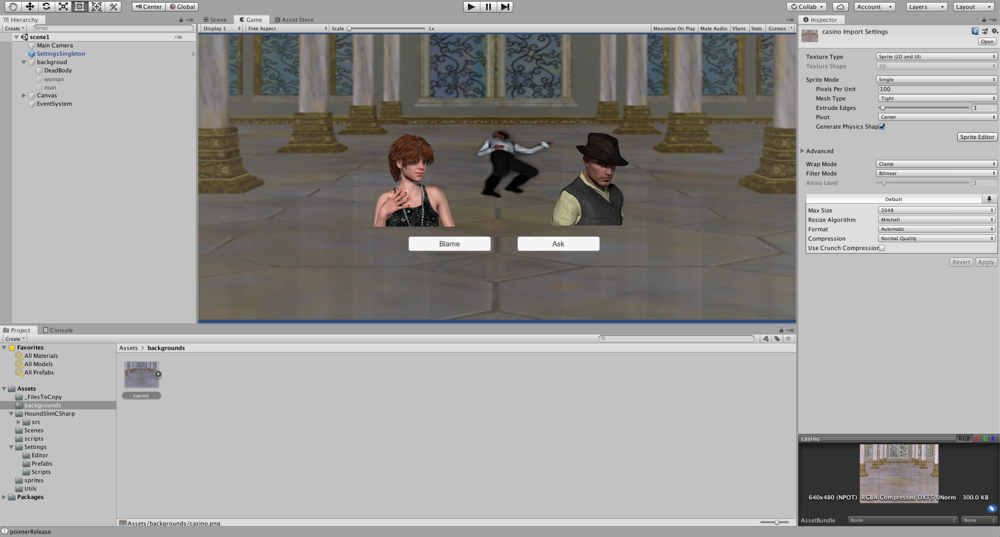

# Houndify Unity Example

This repository provides examples using the [Houndify C# SDK](https://www.houndify.com/sdks#CSharp), which allows you to integrate Voice AI into your Unity applications or others that utilize C#.

Here, we've prepared an example game the Mystery at Hound Casino demonstrating the main components of the Houndify SDK in Unity. See [Unity Tutorial](https://medium.com/p/19144570afd7/) for more details and a complete walkthrough.

Feel free to explore the code to get a feel for how to use Houndify in Unity.  If you looking for easy to use Voice AI integration your in the right place.

## Installation

1. Clone this repository.
2. Import into Unity
3. Add your Client ID and Client Key into the `Assets/Settings/Scripts/Settings.cs` file.
4. Set up Custom Commands in Houndify for full character interactions

## Repository Structure and Usage

### Assets/Settings/Scripts/Settings.cs

This file contains some configuration information for the example project. Open it and enter your clientId/clientKey from your Houndify account.

### Assets/Scripts/GameIntro.cs

Retrieves text based game intro from Houndify.  Demonstrates how to create text requests.

### Assets/Scripts/button.cs
Streams audio and retrieves partial transcripts from the Houndify utilizing the voice endpoint.